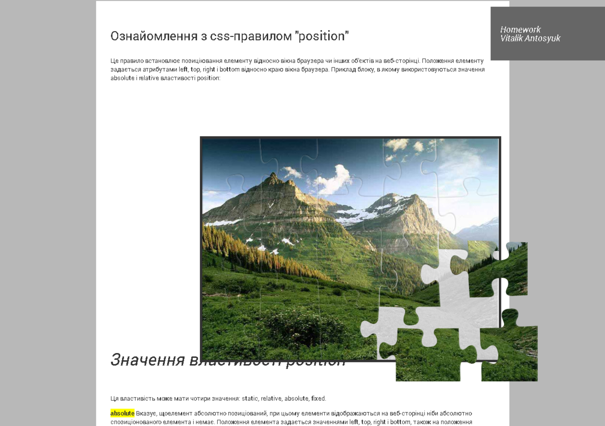
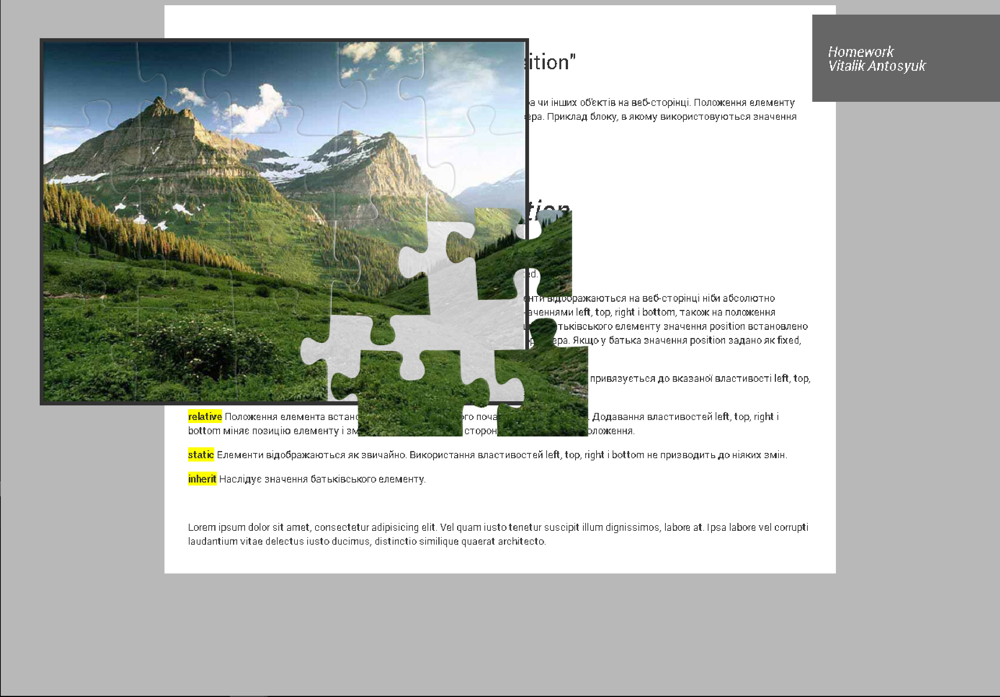
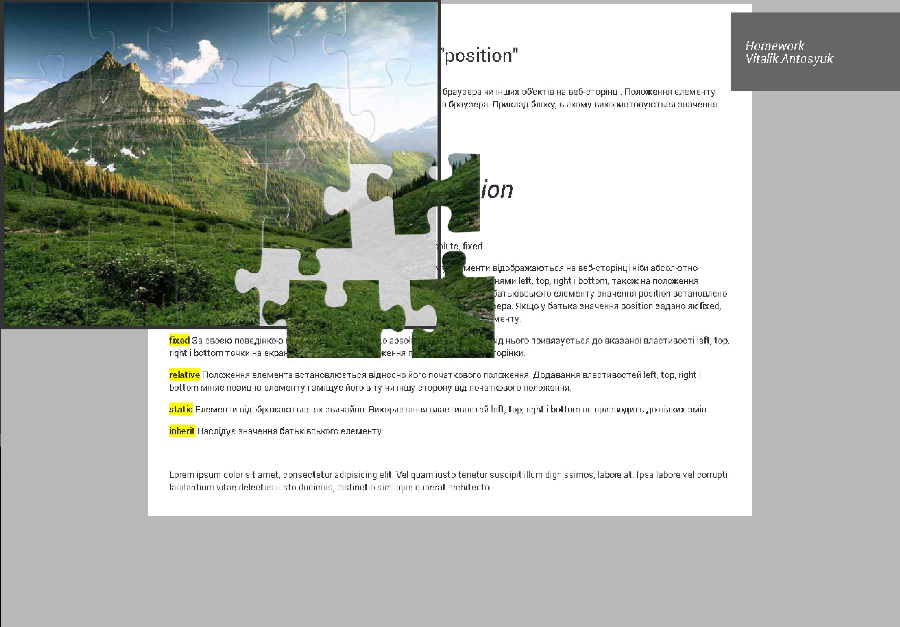
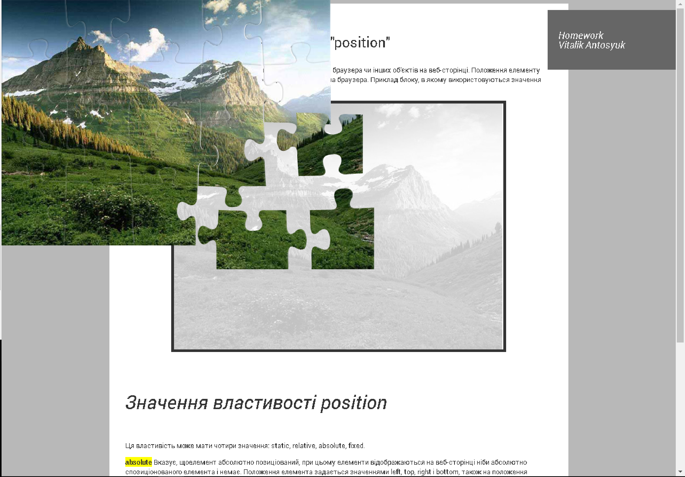
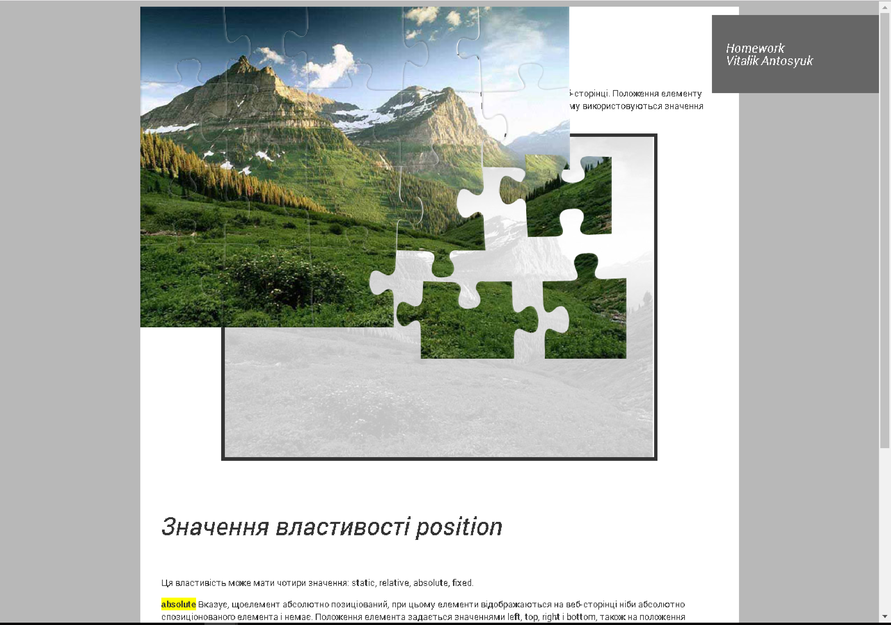

# hmw.css.2
> #puzzle {position:relative;top:100px;left:100px;}
+ 

> #puzzle {position: absolute;top:50px;left:50px;}
+ 

> #puzzle {position:fixed;top:0;left:0;}
+ 

> #puzzle {position:static;top:100px;left:100px;}
+ 

> #puzzle {position:static;} #content{position:relative;}
+ 

